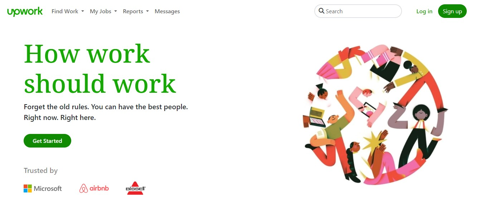

# Upwork Clone

A clone of the Upwork platform, featuring login, sign-up, home, and job search pages. Users can create accounts, log in, and search for available jobs. The job details are fetched from a simulated API.

## Table of Contents

- [Features](#features)
- [Installation](#installation)
- [Usage](#usage)
- [Technologies Used](#technologies-used)
- [Contributing](#contributing)
- [License](#license)

## Features

- User authentication: Login and sign-up pages with local storage-based account management.
- Home Page: Landing page with an overview of the platform and its features.
- Responsive Design: Ensures a seamless experience across different devices.

## Installation

1. Clone the repository: `git clone https://github.com/ahmedshaaban1608/Upwork-partial-clone`

## Usage

1. Open the `index.html` file in your web browser.
2. Use the navigation bar to explore different pages: Home, Login, Sign Up, and Find Jobs.
3. Create an account or log in to access the job search functionality.

## Technologies Used

- HTML
- CSS (Bootstrap)
- JavaScript
- jQuery

## Contributing

Contributions are welcome! If you find any issues or want to enhance the project, feel free to open a pull request.

1. Fork the project.
2. Create your feature branch: `git checkout -b feature/new-feature`
3. Commit your changes: `git commit -m 'Add a new feature'`
4. Push to the branch: `git push origin feature/new-feature`
5. Open a pull request.

## Credits

The Upwork Close project is created by Ahmed Shaaban and is based on learning materials from various web development resources.

---

**Disclaimer**: This project is a clone created for educational purposes and is not affiliated with or endorsed by Upwork.
